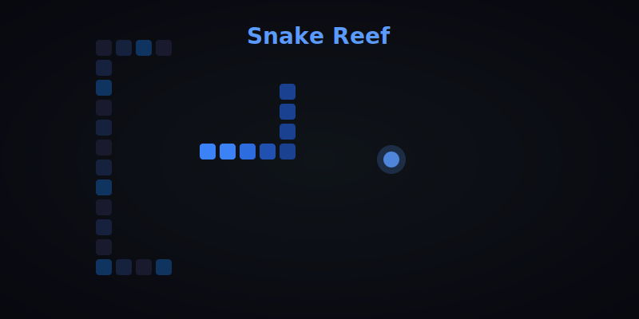

# Snake Reef

A canvas-based snake game with obstacles, glowing food orbs, and a dark reef theme.

## Play

Open index.html in a browser.

`ash
npx serve .
`

## Features

- Classic snake mechanics with obstacle rocks
- Glowing food orbs with bloom effect
- Gradient snake body (head-to-tail fade)
- Score and high-score tracking
- Responsive canvas sizing

## Stack

- Vanilla JavaScript
- Canvas 2D API
- No dependencies — single HTML file

## License

MIT © [Alex Black](https://github.com/AlexBlack-Dev)